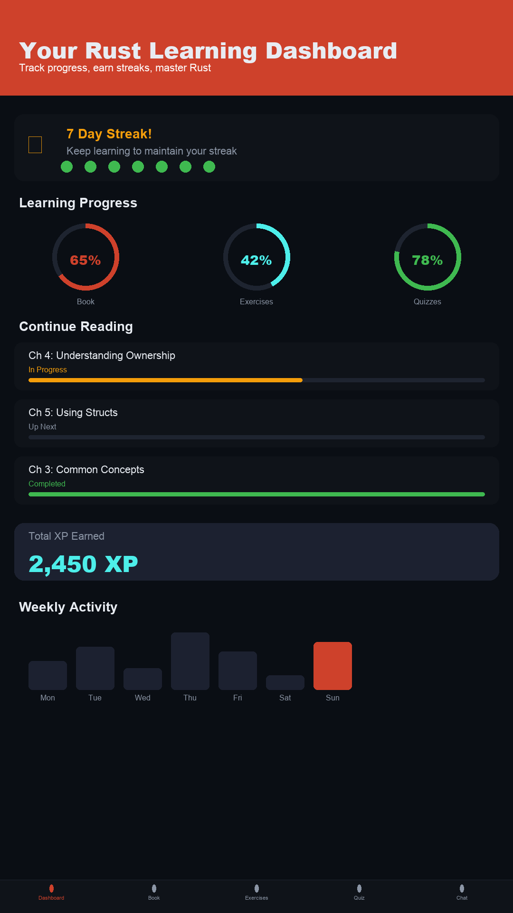
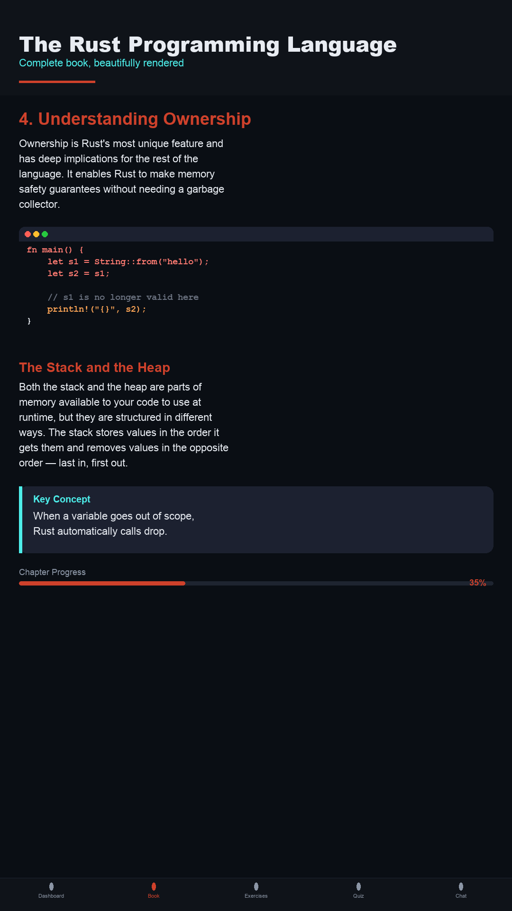
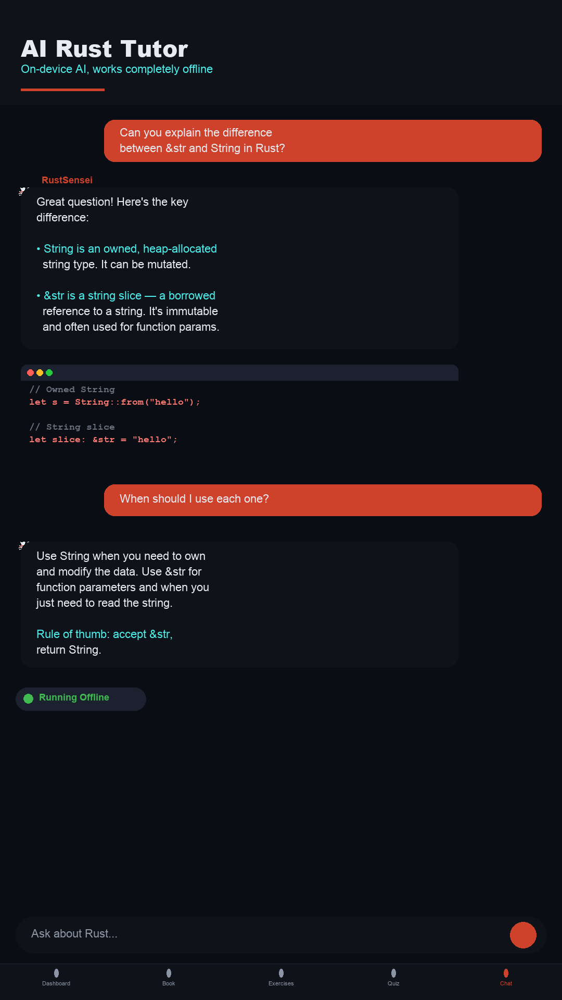
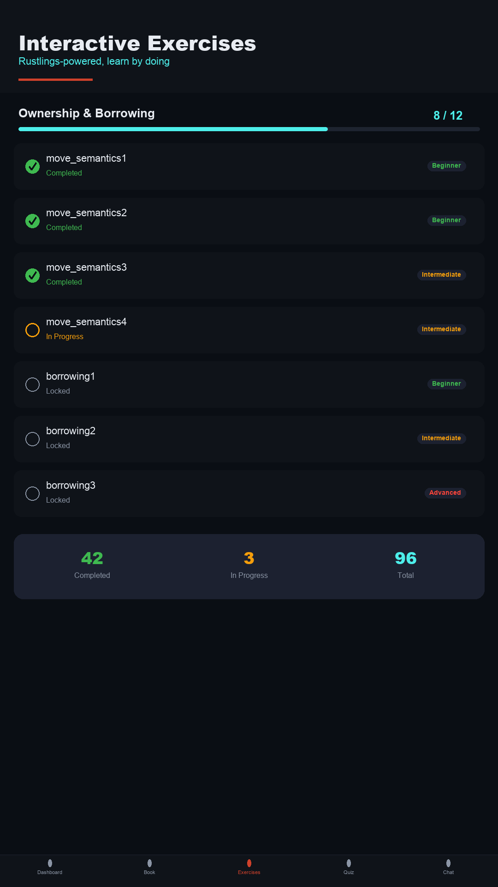
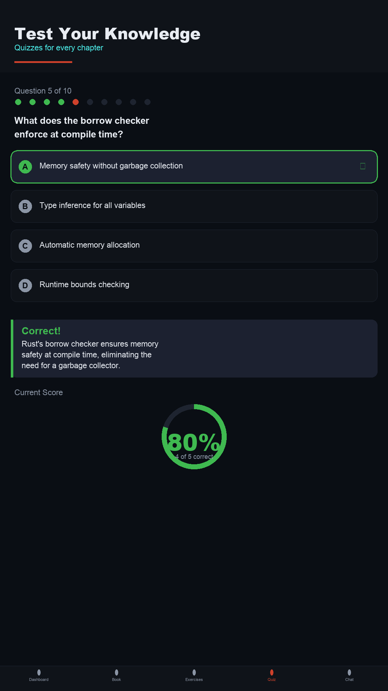
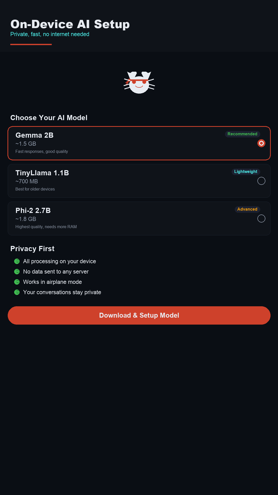

```
██████╗ ██╗   ██╗███████╗████████╗███████╗███████╗███╗   ██╗███████╗███████╗██╗
██╔══██╗██║   ██║██╔════╝╚══██╔══╝██╔════╝██╔════╝████╗  ██║██╔════╝██╔════╝██║
██████╔╝██║   ██║███████╗   ██║   ███████╗█████╗  ██╔██╗ ██║███████╗█████╗  ██║
██╔══██╗██║   ██║╚════██║   ██║   ╚════██║██╔══╝  ██║╚██╗██║╚════██║██╔══╝  ██║
██║  ██║╚██████╔╝███████║   ██║   ███████║███████╗██║ ╚████║███████║███████╗██║
╚═╝  ╚═╝ ╚═════╝ ╚══════╝   ╚═╝   ╚══════╝╚══════╝╚═╝  ╚═══╝╚══════╝╚══════╝╚═╝
```

**An offline Android app that teaches Rust programming through an on-device AI tutor, interactive exercises, quizzes, and a structured book — all running locally via LiteRT.**

> No internet required after the initial model download. No data leaves your device.

[](https://github.com/sylvester-francis/RustSensei/releases)


[Download APK](#install) · [Features](#features) · [Screenshots](#screenshots) · [Model](#model) · [Architecture](#architecture) · [Build](#build-from-source) · [Privacy](#privacy)

---

## Screenshots

<p align="center">
  
  
  
</p>
<p align="center">
  
  
  
</p>

## Why RustSensei?

Most programming tutors require a constant internet connection and send your data to cloud servers. RustSensei takes a different approach:

**Everything runs on your device.** A fine-tuned 1B parameter LLM runs locally via Google's LiteRT with GPU acceleration. Your conversations, progress, and learning data never leave your phone. Pair that with a full Rust curriculum — book, exercises, quizzes, flashcards — and you have a complete Rust learning environment in your pocket.

## Features

- **On-Device AI Tutor** — fine-tuned 1B parameter LLM with GPU-accelerated streaming inference via LiteRT
- **Context-Aware Help** — ask about a book section or get help with an exercise, and the AI has full context
- **Socratic & Rubber Duck Modes** — AI asks guiding questions or lets you explain concepts back, with 3 switchable chat modes
- **Rust Playground** — write Rust code and see simulated output via on-device AI execution tracing
- **Explain This Error** — paste any compiler error and get a clear AI explanation enriched with 44 bundled error references
- **19-Chapter Rust Book** — from Getting Started to Macros, with code examples and reading progress tracking
- **97 Coding Exercises** — Rustlings-style challenges with syntax-highlighted editor, hints, and AI-powered code review
- **Code Refactoring Challenges** — transform ugly-but-working Rust code into idiomatic style, scored by AI (0-100)
- **Daily Challenges** — a new deterministic exercise every day with completion tracking and streak integration
- **3 Guided Projects** — multi-step builds (CLI Todo, Word Counter, JSON Parser) tying chapters together
- **5 Topic Quizzes** (32 questions) — multiple choice, true/false, and code completion with score rings and detailed feedback
- **110+ Spaced Repetition Flashcards** — SM2-scheduled review system for long-term retention
- **5 Guided Learning Paths** — structured step-by-step progression through Rust concepts
- **Ownership Visualizer** — interactive step-by-step memory diagrams for moves, borrows, clones, drops, and Rc
- **Offline Rust Docs** — bundled searchable stdlib reference for 25 core types (String, Vec, Option, Result, HashMap, Iterator, Path, File, Future, Channel, and more)
- **12 Reference Guides** — cheat sheets, compiler errors, language comparisons, design patterns, glossary
- **Study Reminders** — push notifications for due flashcards and streak-at-risk via WorkManager
- **Home Screen Widget** — glanceable Glance AppWidget showing streak count and due flashcards
- **Dark/Light Theme** — system-aware theme toggle with full Material 3 light and dark color schemes
- **Study Streaks** — animated flame, weekly activity dots, and daily goals for reading, exercises, and quizzes
- **Achievement Badges** — unlock milestones for reading, coding, quizzes, and streaks
- **Activity Heatmap** — GitHub-style weekly visualization of your learning activity
- **Conversation History** — persisted locally, accessible from a navigation drawer
- **Exercise Search & Filter** — search 200+ exercises by name, filter by difficulty (Beginner/Intermediate/Advanced)
- **Confetti Celebrations** — particle burst on exercise completion, daily goal, review session, quiz high score
- **3D Flashcard Flip** — smooth rotation animation when revealing card answers
- **Haptic Feedback** — tactile response on send, answer selection, and flashcard rating
- **First-Launch Onboarding** — guided "Start Chapter 1" card for new users
- **Time Estimates** — "~48 min" reading time on each book chapter

## Install

Download the latest signed APK from [GitHub Releases](https://github.com/sylvester-francis/RustSensei/releases):

1. Download `app-release.apk` from the latest release
2. On your Android device, enable **Settings > Install from Unknown Sources** for your browser
3. Open the downloaded APK and tap **Install**
4. Launch RustSensei and download the AI model from the **Settings** tab (~1.2 GB, one-time)

All learning content (book, exercises, quizzes, flashcards) works immediately — the model is only needed for the AI chat tutor.

## Model

Downloads from Hugging Face on first use:

| Model | Parameters | Quantization | Size | RAM |
|-------|-----------|-------------|------|-----|
| [Rust Mentor 1B](https://huggingface.co/sylvester-francis/rust-mentor-1b-mobile-LiteRT) | 1B | Q8 | ~1.2 GB | ~3 GB |

The model runs entirely on-device using the GPU via LiteRT's OpenCL delegate. No data is sent to any server.

## Requirements

| Requirement | Minimum |
|-------------|---------|
| Android | 8.0+ (API 26) |
| GPU | Required (tested on Pixel 8 Pro / Tensor G3) |
| Storage | ~1.2 GB for the model |
| RAM | ~3 GB available for inference |

## Architecture

Built on **Clean Architecture** with SOLID principles and Google's recommended Android patterns.

```
┌──────────────────────────────────────────────────┐
│  UI Layer (Jetpack Compose + @Immutable states)  │
│  Type-safe @Serializable navigation              │
├──────────────────────────────────────────────────┤
│  ViewModel Layer (@HiltViewModel)                │
│  Thin coordinators — map events to UI state      │
├──────────────────────────────────────────────────┤
│  Domain Layer (UseCases)                         │
│  SendChatMessageUseCase, ValidateExerciseUseCase │
├──────────────────────────────────────────────────┤
│  Abstractions (interfaces)                       │
│  InferenceEngine, ModelLifecycle, ContentProvider │
├──────────────────────────────────────────────────┤
│  Data / Infra (Room, LiteRT, OkHttp)            │
│  Concrete implementations, Hilt-provided         │
└──────────────────────────────────────────────────┘
```

```
app/src/main/java/com/sylvester/rustsensei/
├── di/                      # Hilt DI modules (DataModule, InferenceModule)
├── domain/                  # UseCases (SendChatMessage, ValidateExercise, SimulateExecution, etc.)
├── data/                    # Room database, DAOs, repositories
├── content/                 # Bundled JSON content + RAG retriever + docs + visualizations
├── llm/
│   ├── InferenceEngine.kt   # Abstraction for LLM inference
│   ├── LiteRtEngine.kt      # LiteRT GPU implementation
│   ├── ModelLifecycleManager.kt  # Load/unload/idle-timer lifecycle
│   ├── ModelManager.kt      # Download with resume + SHA256 verification
│   └── ChatTemplateFormatter.kt  # ChatML formatting + sanitization
├── ui/
│   ├── theme/               # Color, Type, Tokens (Spacing, Alpha, Dimens)
│   ├── components/          # 20+ reusable composables
│   └── screens/             # 24 screen files (split for maintainability)
├── viewmodel/               # 18 @HiltViewModel classes
├── widget/                  # Glance home screen widget
└── work/                    # WorkManager study reminder scheduler
```

## Tech Stack

| Component | Technology |
|-----------|------------|
| Language | Kotlin 2.2 |
| UI | Jetpack Compose (100% Compose, no XML) |
| Design System | Material 3 with custom design tokens (Spacing, Alpha, Dimens) |
| DI | Hilt (`@HiltViewModel`, `@Binds`, `@Provides`) |
| Architecture | MVVM + Clean Architecture (UseCases, Repository interfaces) |
| AI Inference | LiteRT — GPU-accelerated via OpenCL with idle-unload lifecycle |
| Database | Room (12 entities, 3 DAOs, 8 migrations) |
| Navigation | Navigation Compose 2.8+ with type-safe `@Serializable` routes |
| Async | Coroutines + Flow for streaming inference and reactive UI |
| Serialization | Kotlin Serialization (navigation routes, future JSON parsing) |
| Network | OkHttp for model download with resume + SHA256 verification |
| Testing | JUnit + Turbine + test doubles (50 tests, 7 suites) |

## Build from Source

**Prerequisites:** Android Studio, JDK 11+

```bash
git clone https://github.com/sylvester-francis/RustSensei.git
cd RustSensei
./gradlew assembleDebug
adb install app/build/outputs/apk/debug/app-debug.apk
```

## Acknowledgments

| Project | License | Usage |
|---------|---------|-------|
| [The Rust Programming Language](https://github.com/rust-lang/book) | MIT / Apache 2.0 | Book content adapted for mobile |
| [Rustlings](https://github.com/rust-lang/rustlings) | MIT | Exercise concepts and structure |
| [Google LiteRT](https://github.com/google-ai-edge/LiteRT) | Apache 2.0 | On-device GPU-accelerated inference |

## Privacy

RustSensei collects no data. No analytics, no tracking, no accounts, no telemetry. Everything runs on-device. See [Privacy Policy](PRIVACY_POLICY.md).

## Author

**Sylvester Ranjith Francis**

[](https://github.com/sylvester-francis)
[](https://huggingface.co/sylvester-francis)
[](https://www.linkedin.com/in/sylvesterranjith/)
[](https://techwithsyl.substack.com/)
[](https://medium.com/@sylvesterranjithfrancis)
[](https://www.instagram.com/techwithsyl)

## License

Apache License 2.0 — see [LICENSE](LICENSE) for details.
